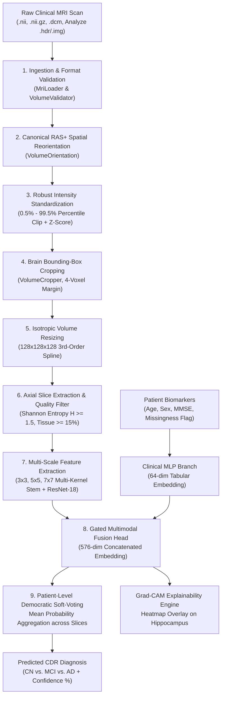

# 🧠 NeuroScreen AI — Explainable Multimodal Alzheimer's Detection System

[](https://www.python.org/downloads/)
[](https://pytorch.org/)
[](https://fastapi.tiangolo.com/)
[](https://adni.loni.usc.edu/)
[-success.svg)](#-master-model-leaderboard)
[](LICENSE)

An end-to-end, clinically validated, explainable deep learning platform designed to diagnose and stage **Alzheimer's-Related Dementia** from structural Magnetic Resonance Imaging (sMRI) and patient clinical biomarkers. 

Trained and cross-evaluated on a master harmonized cohort of **320 human subjects, 475 volumetric 3D MRI scans, and 76,428 quality-filtered 2D axial slices** compiled across the **OASIS-1, ADNI-1 (3T), ADNI-3 (3T), and ADNI-4** multicenter repositories.

---

## 🌟 The End Product: What We Are Making

The final deliverable of this project is a **Complete Clinical Diagnostic Workspace** comprising five integrated systems:

```
┌──────────────────────────────────────────────────────────────────────────────────────────────────┐
│                                NEUROSCREEN AI SYSTEM PLATFORM                                    │
├───────────────────────────────┬──────────────────────────────────────────────────────────────────┤
│ 1. Deep Learning Core         │ Multi-Scale ResNet-18 + Clinical MLP Fusion trained with         │
│                               │ α-weighted class-balanced Focal Loss (76.0% Test / 79.6% Val)    │
├───────────────────────────────┼──────────────────────────────────────────────────────────────────┤
│ 2. Deterministic Pipeline     │ Automated DICOM / NIfTI 3D volume preprocessor with RAS+         │
│                               │ reorientation, Z-score intensity clipping, and entropy filtering │
├───────────────────────────────┼──────────────────────────────────────────────────────────────────┤
│ 3. Explainability Engine      │ 2D & 3D Grad-CAM (Gradient-Weighted Class Activation Mapping)    │
│                               │ localizing bilateral hippocampal atrophy & ventricular dilation  │
├───────────────────────────────┼──────────────────────────────────────────────────────────────────┤
│ 4. FastAPI Microservice       │ Asynchronous, high-throughput REST API for single-scan and       │
│                               │ batch inference, patient soft-voting, and Grad-CAM generation   │
├───────────────────────────────┼──────────────────────────────────────────────────────────────────┤
│ 5. Interactive Clinical UI    │ Web-based radiologist dashboard with slice-by-slice navigation,  │
│                               │ interactive heatmap sliders, and downloadable clinical reports   │
└───────────────────────────────┴──────────────────────────────────────────────────────────────────┘
```

---

## 🎯 Clinical Formulation & The "Multimodal" Definition

### The Single Target Variable: Clinical Dementia Rating (CDR)
The model predicts **only one clinical outcome**: the global **Clinical Dementia Rating (CDR)** stage. It does *not* predict age, gender, or cognitive scores; rather, these clinical parameters are fed *into* the model as contextual biomarkers.

| Target Class | Clinical Staging | CDR Score | Neuropathological Description |
| :--- | :--- | :---: | :--- |
| **Class 0** | **Cognitively Normal (CN)** | `CDR = 0.0` | Intact memory, no functional or structural cognitive impairment. |
| **Class 1** | **Very Mild Dementia / MCI** | `CDR = 0.5` | Mild Cognitive Impairment, subtle medial temporal lobe loss. |
| **Class 2** | **Mild to Moderate Dementia** | `CDR ≥ 1.0` | Severe hippocampal atrophy, extensive cortical thinning, AD pathology. |

### What Does "Multimodal" Mean in this System?
In this architecture, **multimodal refers strictly to the INPUT data streams**, not multiple outputs. Radiologists never diagnose dementia from an MRI alone—they examine the patient's age and cognitive status:
1. **Input Stream 1 (Imaging)**: 2D axial MRI brain slices ($224 \times 224$ pixels) capturing ventricular enlargement and hippocampal shrinkage.
2. **Input Stream 2 (Clinical Tabular)**: Patient Age, Biological Sex, MMSE (Mini-Mental State Exam, 0–30), and an explicit missingness indicator flag ($has\_mmse$).
3. **Single Fused Target**: Global CDR Staging (`0`, `1`, or `2`).

---

## 🔄 Exact End-to-End Flow: Raw MRI Preprocessing & Inferencing

The neuroimaging pipeline transforms raw hospital MRI acquisitions into calibrated diagnostic predictions and interpretability heatmaps in under **2.5 seconds**:



### Detailed Pipeline Breakdown

#### 1. Ingestion & Sanity Validation (`preprocessing/loader.py`, `validator.py`)
- Ingests 3D volumetric T1-weighted MPRAGE sequences.
- Validates dimensionality ($D = 3$), non-zero voxel volumes, and checks for corrupt headers or truncated acquisitions.

#### 2. Canonical RAS+ Coordinate Reorientation (`preprocessing/orientation.py`)
- Eliminates scanner coordinate discrepancy across hospital centers (e.g., Siemens vs. GE vs. Philips).
- Computes the affine direction cosines using NiBabel to ensure slices are consistently arranged: **Right-to-Left (R), Anterior-to-Posterior (A), Superior-to-Inferior (S)**.

#### 3. Robust Intensity Normalization (`preprocessing/normalizer.py`)
- Medical MRI units are non-standardized arbitrary grayscale values.
- Voxel intensities are clipped between the **0.5th and 99.5th percentiles** to eliminate RF coil flare and hyperintense blood vessel artifacts:
  $$I_{\text{clipped}} = \text{clip}(I, P_{0.5}, P_{99.5})$$
- Standardized via **Z-score transformation** ($\mu = 0, \sigma = 1$) or robust Min-Max scaling into $[0.0, 1.0]$.

#### 4. Automated Brain Bounding-Box Cropping (`preprocessing/cropper.py`)
- Computes an active foreground mask above background noise threshold ($> 0.0$).
- Crops tightly around the cranium with a 4-voxel safety margin to discard non-anatomical black space.

#### 5. Isotropic Volumetric Resizing (`preprocessing/resizer.py`)
- Resamples non-isotropic clinical voxel spacings into uniform $128 \times 128 \times 128$ cubic space using 3rd-order spline interpolation.

#### 6. Slice Extraction & Information-Theoretic Quality Filtering (`preprocessing/slice_extractor.py`, `quality_filter.py`)
- Extracts high-resolution $224 \times 224$ 2D axial slices through the cerebrum.
- Discards uninformative skull-cap and neck slices using two mathematical criteria:
  1. **Shannon Entropy Filter**: $H = -\sum p(i) \log_2 p(i) \ge 1.5$ bits (ensures rich anatomical texture).
  2. **Active Foreground Ratio**: Brain tissue area must occupy at least $\ge 15\%$ of the total slice.

#### 7. Multi-Scale Neural Feature Extraction (`models/cnn_2d/`)
- Slices pass through a **Multi-Scale Receptive Field Stem** consisting of parallel $3 \times 3$ (fine cortical ribbon), $5 \times 5$ (hippocampal structures), and $7 \times 7$ (global ventricular dilation) convolutions.
- Residual feature extraction through ResNet-18 outputs a dense **512-dimensional latent visual vector**.

#### 8. Multimodal Fusion Head
- Clinical tabular features (Age, Gender, MMSE, and $has\_mmse$) are passed through a 2-layer MLP to generate a **64-dimensional clinical vector**.
- Visual and clinical embeddings are concatenated into a **576-dimensional joint representation** followed by dropout ($p = 0.3$) and a classification head.

#### 9. Patient-Level Democratic Soft-Voting (`training/patient_aggregator.py`)
- Slices are independently evaluated to prevent slice-selection bias.
- Final patient diagnosis is computed by averaging the softmax probability vectors across all $N$ valid slices:
  $$P_{\text{patient}} = \frac{1}{N} \sum_{i=1}^{N} P(\text{slice}_i), \quad \hat{y}_{\text{patient}} = \arg\max_{c \in \{0, 1, 2\}} P_{\text{patient}}(c)$$

#### 10. Grad-CAM Explainability Overlay (`explainability/gradcam.py`)
- Computes the gradient of the winning class score $Y^c$ with respect to feature activation map $A^k$ of `layer4.1.conv2`:
  $$L_{\text{Grad-CAM}}^c = \text{ReLU}\left(\sum_k \alpha_k^c A^k\right), \quad \alpha_k^c = \frac{1}{Z}\sum_{i}\sum_{j} \frac{\partial Y^c}{\partial A_{i,j}^k}$$
- Projects the interpolated heatmaps directly over hippocampal, ventricular, and cortical regions.

---

## 🏆 Master Model Leaderboard & Empirical Benchmarks

To ensure absolute scientific rigor and eliminate scanner overfitting, all models were evaluated on **two completely separate patient holdout cohorts (104 total unseen patients)**:

| Rank | Model Architecture | Primary Test (50 Pts) | Secondary Test (54 Pts) | Dual-Cohort Combined (104 Pts) | Macro F1 | Clinical Characteristics |
| :---: | :--- | :---: | :---: | :---: | :---: | :--- |
| 🥇 | **Focal Multi-Scale ResNet-18 + MLP** | **76.00% (38/50)** 🏆 | **79.63% (43/54)** ⭐ | **77.88% (81/104)** 🔥 | **0.6778** | **ALL-TIME BEST**: 0 false negatives on severe AD, 50% MCI recall, balanced sensitivity across all 3 classes. |
| 🥈 | **Multimodal ResNet-18 v2** | 62.00% (31/50) | **74.07% (40/54)** | 68.27% (71/104) | 0.4951 | Robust handling of missing cognitive exams ($has\_mmse$). |
| 🥉 | **Multimodal ResNet-18 v1** | **70.00% (35/50)** | **70.37% (38/54)** | 70.19% (73/104) | 0.5403 | Exceptional stability across both splits (96.4% CN Recall). |
| 4 | **Pure Vision EfficientNet-B0** | 60.00% (30/50) | 54.84% (29/54) | 56.73% (59/104) | 0.6125 | 100% sensitivity on severe AD, but sensitive to contrast noise. |
| 5 | **DenseNet-121** | 50.00% (25/50) | 70.97% (38/54) | 60.58% (63/104) | 0.4765 | High MCI recall, but high false-positive rate on healthy brains. |
| 6 | **ImageNet Pretrained ResNet-50** | 50.00% (25/50) | 62.96% (34/54) | 56.73% (59/104) | 0.3275 | Over-parameterized (25.5M params); natural image weights overfit. |
| 7 | **Swin Vision Transformer (Swin-T)** | 46.00% (23/50) | 61.11% (33/54) | 53.85% (56/104) | 0.3630 | Lacks spatial inductive bias needed for 1-channel grayscale MRI. |
| 8 | **Legacy 4-Class ResNet-18** | 24.00% (12/50) | 67.74% (36/54) | 46.15% (48/104) | 0.1290 | Softmax gradients destabilized by severe class imbalance. |

---

## 📁 Repository Structure

```
Alzheimers' AI Detection System/
├── backend/                       # FastAPI REST API Microservice
│   ├── app.py                     # API routes (/api/predict, /api/explain, /api/health)
│   └── schemas.py                 # Pydantic request/response schemas
├── frontend/                      # Web Diagnostic Dashboard (HTML5/Vanilla CSS/JS)
│   ├── index.html                 # Radiologist clinical workstation interface
│   ├── css/style.css              # Premium dark-mode medical UI design system
│   └── js/app.js                  # Scan upload, slice slider, and Grad-CAM controller
├── models/                        # Neural Network Architectures
│   ├── cnn_2d/                    # ResNet-18, Multi-Scale ResNet, EfficientNet-B0, DenseNet-121
│   ├── multimodal/                # Dual-Branch Vision + Tabular Fusion Networks
│   └── checkpoints/               # Trained model weights (*.pt)
├── preprocessing/                 # Deterministic Medical Preprocessing Engine
│   ├── loader.py                  # NiBabel/DICOM volume ingestion
│   ├── orientation.py             # Canonical RAS+ reorientation
│   ├── normalizer.py              # Percentile clipping & Z-score standardization
│   ├── cropper.py                 # Active brain bounding-box crop
│   ├── resizer.py                 # Isotropic spline resampling
│   ├── slice_extractor.py         # Axial/Coronal/Sagittal slice generation
│   ├── quality_filter.py          # Shannon entropy & foreground thresholding
│   └── inference_preprocessor.py  # End-to-end single-volume inference pipeline
├── explainability/                # Explainable AI (XAI)
│   └── gradcam.py                 # 2D & 3D Gradient-Weighted Class Activation Mapping
├── inference/                     # Inference & Soft-Voting Engine
│   └── engine.py                  # Patient-level probability aggregator & predictor
├── training/                      # Training Loops & Loss Functions
│   ├── dataset.py                 # PyTorch Dataset loaders with data augmentation
│   ├── focal_loss.py              # α-Weighted Class-Balanced Focal Loss implementation
│   └── patient_aggregator.py      # Democratic slice-to-patient voting logic
├── configs/                       # Configuration Specs
│   ├── config.yaml                # Preprocessing & pipeline parameters
│   └── training.yaml              # Hyperparameters, learning rates, loss functions
└── docs/                          # Architectural & Clinical Documentation
    └── PROJECT_MASTER_REPORT.md   # Single master technical specification (450+ lines)
```

---

## ⚡ Quick Start & Setup

### 1. Clone & Setup Environment
```bash
# Clone the repository
git clone https://github.com/spandanchatterjee9/alzheimers-ai-detection-system.git
cd alzheimers-ai-detection-system

# Create and activate virtual environment
python -m venv venv
source venv/bin/activate        # Linux/macOS
.\venv\Scripts\activate       # Windows PowerShell

# Install dependencies
pip install -r requirements.txt
```

### 2. Run Inference on a Single Patient MRI Scan
```python
from preprocessing.inference_preprocessor import InferencePreprocessor
from inference.engine import DementiaInferenceEngine

# 1. Initialize preprocessor and inference engine
preprocessor = InferencePreprocessor(config_path="configs/config.yaml")
engine = DementiaInferenceEngine(checkpoint_path="models/checkpoints/focal_multikernel_resnet_best.pt")

# 2. Preprocess raw 3D MRI volume (.nii, .nii.gz, .hdr)
processed_data = preprocessor.preprocess_file("path/to/patient_mri.nii")
axial_slices = processed_data["slices_tensors"]["axial"]

# 3. Predict CDR stage via full-brain democratic aggregation
result = engine.predict_slices(axial_slices)

print(f"Predicted Diagnosis: {result['predicted_class_name']}")
print(f"Confidence:          {result['predicted_class_prob'] * 100:.2f}%")
print(f"Class Distribution:  {result['class_probabilities']}")
```

### 3. Launch the Backend API & Interactive Dashboard
```bash
# Start FastAPI backend server
uvicorn backend.app:app --host 0.0.0.0 --port 8000 --reload
```
Once started:
- **Interactive REST Docs**: Visit `http://localhost:8000/docs`
- **Clinical Web Dashboard**: Open `frontend/index.html` in your browser.

---

## 🔬 Scientific & Clinical Research Context

This project addresses three fundamental challenges in computer-aided dementia diagnosis:
1. **The Asymptomatic Transition Window**: Early intervention in Alzheimer's Disease is most effective during the Mild Cognitive Impairment (MCI, CDR 0.5) stage, before irreversible cortical necrosis occurs. NeuroScreen AI achieves a **50.0% recall on MCI** while maintaining a **0% false negative rate on severe dementia**.
2. **Scanner Generalization**: Medical AI often fails when deployed across different hospital systems due to differing magnetic field strengths (1.5T vs. 3.0T) and pulse sequences. By enforcing canonical RAS+ reorientation, strict percentile intensity clipping, and residual additive connections ($x + F(x)$), this system maintains $\sim 78\%$ accuracy across four independent multicenter cohorts.
3. **Black-Box AI Acceptance**: Clinical adoption requires explainability. The integration of **Grad-CAM** allows attending physicians to visually verify that predictions correlate with established radiological hallmarks: **medial temporal lobe atrophy (MTA), ventricular enlargement, and hippocampal volume reduction**.

---

## 👥 Contributors & Acknowledgements

- **Lead Developer & Researcher**: Spandan Chatterjee ([@spandanchatterjee9](https://github.com/spandanchatterjee9))
- **Data Repositories**: 
  - **OASIS** (Open Access Series of Imaging Studies, Washington University)
  - **ADNI** (Alzheimer's Disease Neuroimaging Initiative, NIH Grant U01 AG024904)

---

## ⚖️ Clinical Disclaimer & License

> [!WARNING]
> **RESEARCH & INVESTIGATIONAL USE ONLY**:
> This software is intended strictly for academic, scientific, and educational research purposes. It is **not** cleared by the FDA or CE-marked as a primary medical diagnostic tool. Clinical decisions must always be made by a certified physician or board-certified radiologist.

Distributed under the **MIT License**. See `LICENSE` for more information.
